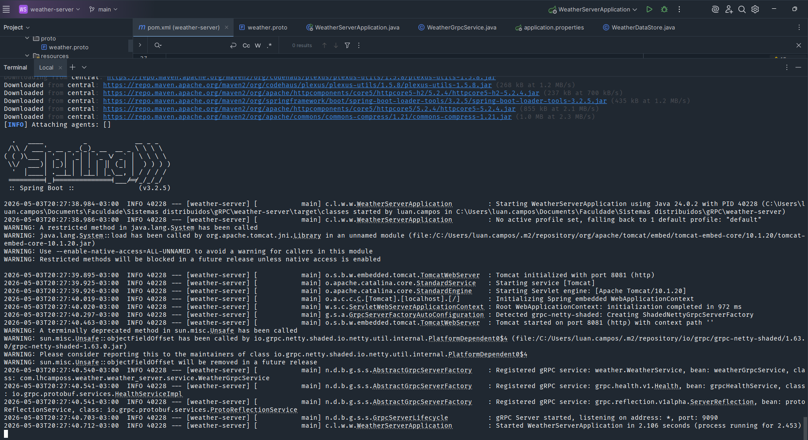
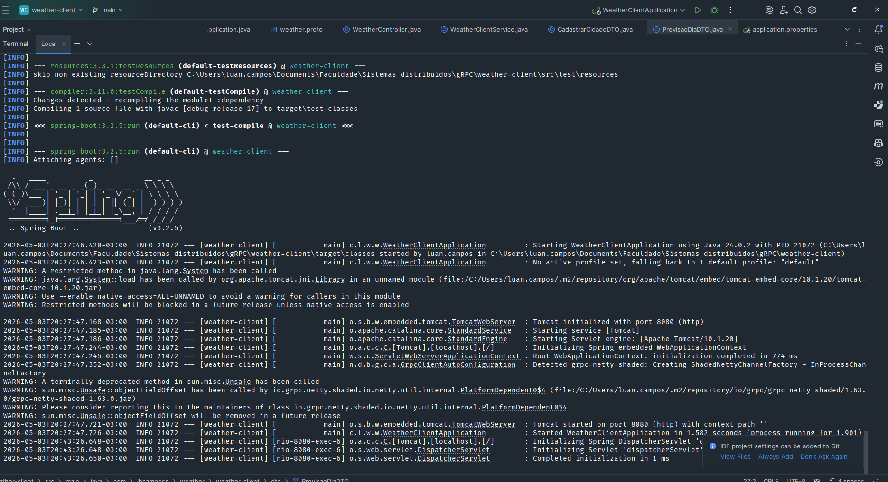
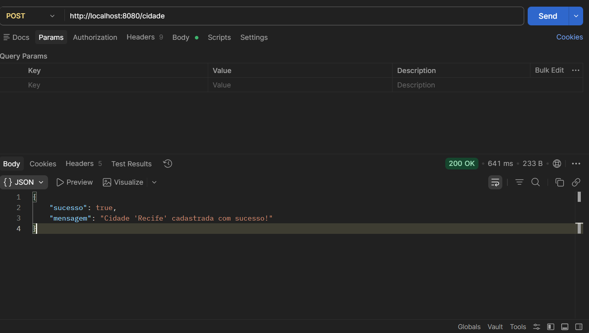
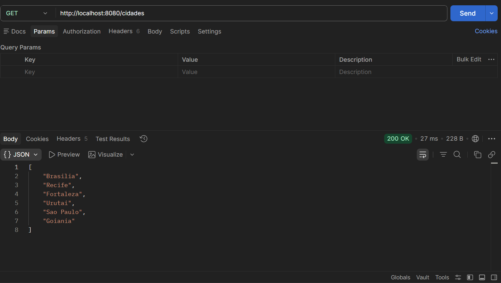
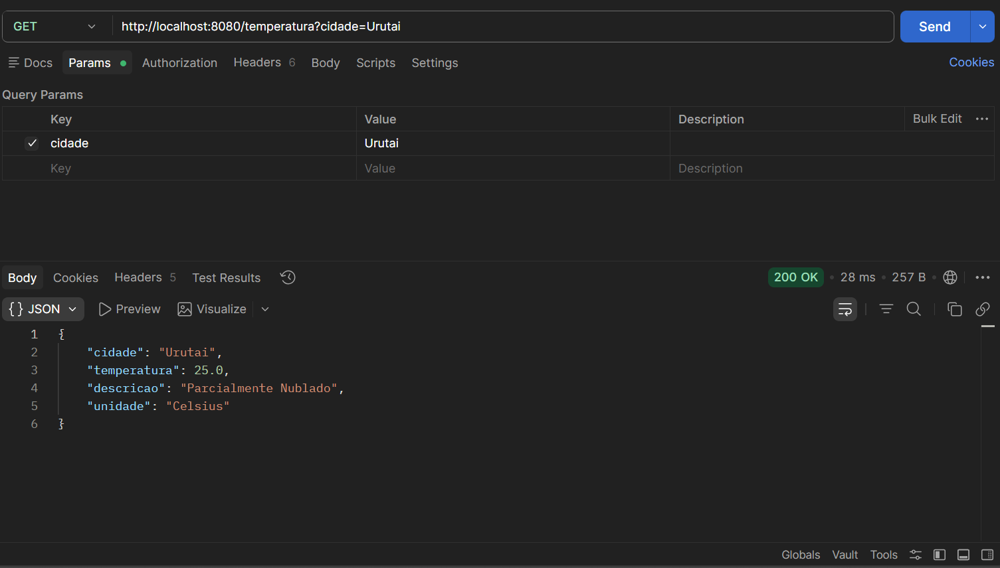
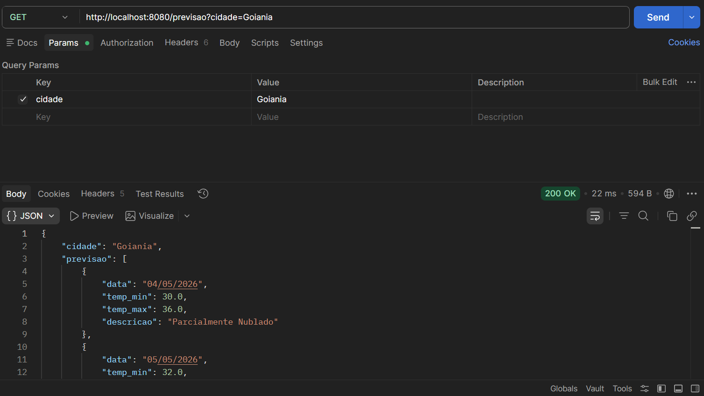
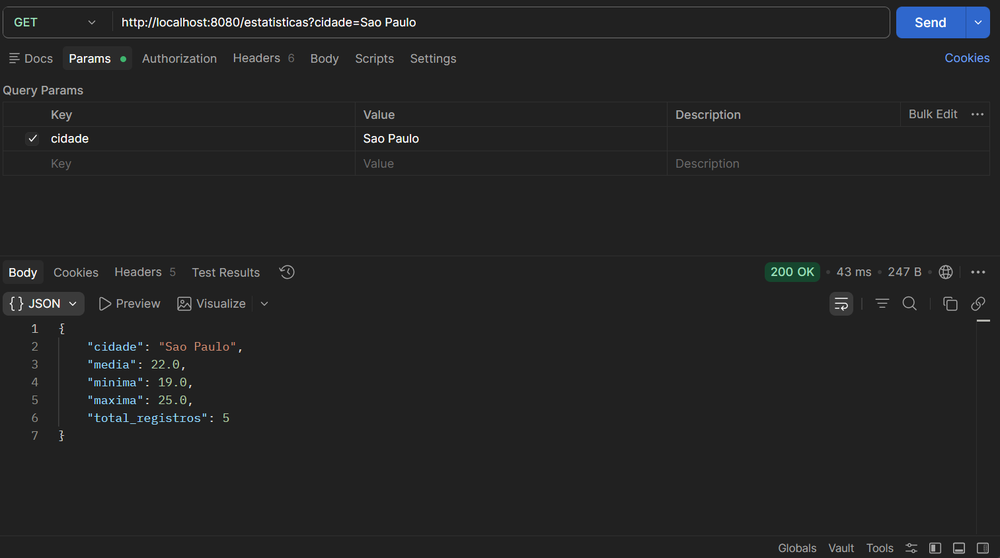

# 🌤️ Sistema de Previsão Meteorológica Distribuído com gRPC e Spring Boot

Sistema distribuído cliente-servidor que fornece informações meteorológicas via gRPC, exposto ao mundo externo como uma API REST.

---

## 📋 Sumário

- [Arquitetura](#arquitetura)
- [Estrutura dos Projetos](#estrutura-dos-projetos)
- [Pré-requisitos](#pré-requisitos)
- [Como Rodar o Projeto](#como-rodar-o-projeto)
- [Explicação do arquivo .proto](#explicação-do-arquivo-proto)
- [Fluxo Completo: de HTTP a gRPC](#fluxo-completo-de-http-a-grpc)
- [Endpoints e Testes com curl/Postman](#endpoints-e-testes-com-curlpostman)
- [Prints do Sistema Funcionando](#prints-do-sistema-funcionando)

---

## Arquitetura

```
Postman/curl
    │
    │  HTTP (porta 8080)
    ▼
┌─────────────────────────┐
│   weather-client        │  Spring Boot REST API
│   @RestController       │
│   WeatherController     │
└────────────┬────────────┘
             │
             │  gRPC / Protobuf (porta 9090)
             │  HTTP/2 + binário
             ▼
┌─────────────────────────┐
│   weather-server        │  Spring Boot gRPC Server
│   @GrpcService          │
│   WeatherGrpcService    │
│                         │
│   WeatherDataStore      │  Dados em memória (HashMap)
└─────────────────────────┘
```

---

## Estrutura dos Projetos

```
gRPC/
├── weather-server/
│   └── src/main/
│       ├── java/com/lhcamposs/weather/weather_server/
│       │   ├── WeatherServerApplication.java
│       │   ├── data/
│       │   │   └── WeatherDataStore.java
│       │   └── service/
│       │       └── WeatherGrpcService.java
│       ├── proto/
│       │   └── weather.proto
│       └── resources/
│           └── application.properties
│
└── weather-client/
    └── src/main/
        ├── java/com/lhcamposs/weather/weather_client/
        │   ├── WeatherClientApplication.java
        │   ├── controller/
        │   │   └── WeatherController.java
        │   ├── dto/
        │   │   ├── CadastrarCidadeDTO.java
        │   │   └── PrevisaoDiaDTO.java
        │   └── service/
        │       └── WeatherClientService.java
        ├── proto/
        │   └── weather.proto
        └── resources/
            └── application.properties
```

---

## Pré-requisitos

- Java 17+
- Maven 3.8+
- IntelliJ IDEA (recomendado)
- Postman ou curl

---

## Como Rodar o Projeto

### 1. Clonar o repositório

```bash
git clone https://github.com/seu-usuario/weather-grpc
cd weather-grpc
```

### 2. Compilar e iniciar o Servidor gRPC (porta 9090)

```bash
cd weather-server
mvn clean compile
mvn spring-boot:run
```

Aguarde a mensagem:
```
gRPC Server started, listening on port 9090
Tomcat started on port 8081
```

### 3. Compilar e iniciar o Cliente REST (porta 8080)

Abra um **novo terminal**:

```bash
cd weather-client
mvn clean compile
mvn spring-boot:run
```

Aguarde a mensagem:
```
Tomcat started on port 8080
```

### Observações importantes para Windows

O `application.properties` deve estar salvo em **UTF-8**. Verifique no rodapé do IntelliJ — deve mostrar `UTF-8`. Se não estiver, clique e altere antes de salvar.

O `pom.xml` de ambos os projetos deve conter dentro de `<properties>`:

```xml
<project.build.sourceEncoding>UTF-8</project.build.sourceEncoding>
<project.reporting.outputEncoding>UTF-8</project.reporting.outputEncoding>
```

Após o `mvn clean compile`, marque as pastas geradas como fontes no IntelliJ:

- `target/generated-sources/protobuf/java` → botão direito → **Mark Directory as → Generated Sources Root**
- `target/generated-sources/protobuf/grpc-java` → botão direito → **Mark Directory as → Generated Sources Root**

---

## Explicação do arquivo `.proto`

O arquivo `weather.proto` é o **contrato** entre cliente e servidor. Ele define os serviços disponíveis e o formato exato das mensagens trocadas. O mesmo arquivo é utilizado nos dois projetos e a partir dele são geradas todas as classes Java necessárias para a comunicação gRPC.

### Definição do Serviço (`service`)

```protobuf
service WeatherService {
  rpc ObterTemperaturaAtual  (CidadeRequest)          returns (TemperaturaResponse);
  rpc PrevisaoCincoDias      (CidadeRequest)          returns (PrevisaoResponse);
  rpc ListarCidades          (ListarCidadesRequest)   returns (ListarCidadesResponse);
  rpc CadastrarCidade        (CadastrarCidadeRequest) returns (CadastrarCidadeResponse);
  rpc EstatisticasClimaticas (CidadeRequest)          returns (EstatisticasResponse);
}
```

O bloco `service` declara o serviço gRPC. Cada `rpc` é um método remoto com um tipo de entrada e um tipo de saída, equivalente a uma interface Java. O cliente chama esses métodos como se fossem locais; o gRPC cuida da comunicação em rede de forma transparente.

### Definição das Mensagens (`message`)

```protobuf
message CidadeRequest {
  string cidade = 1;
}
```

`message` é equivalente a uma classe Java com atributos. Os números (`= 1`, `= 2`...) são **tags de campo** — identificadores únicos usados na serialização binária do Protobuf. Não são valores; funcionam como identificadores que garantem compatibilidade entre versões do sistema.

A palavra-chave `repeated` representa uma lista:

```protobuf
message PrevisaoResponse {
  string cidade = 1;
  repeated PrevisaoDia dias = 2;  // equivalente a List<PrevisaoDia> em Java
}
```

### Explicação de cada RPC implementado

**1. `ObterTemperaturaAtual`**

Recebe o nome de uma cidade e retorna a temperatura atual simulada, com descrição do clima (ex: "Ensolarado") e unidade de medida.

```protobuf
rpc ObterTemperaturaAtual (CidadeRequest) returns (TemperaturaResponse);
```

**2. `PrevisaoCincoDias`**

Recebe o nome de uma cidade e retorna uma lista com previsão de temperatura mínima, máxima e descrição para os próximos 5 dias.

```protobuf
rpc PrevisaoCincoDias (CidadeRequest) returns (PrevisaoResponse);
```

**3. `ListarCidades`**

Não recebe parâmetros significativos (mensagem vazia) e retorna a lista de todas as cidades cadastradas no sistema.

```protobuf
rpc ListarCidades (ListarCidadesRequest) returns (ListarCidadesResponse);
```

**4. `CadastrarCidade`**

Recebe o nome da cidade e uma temperatura inicial. O servidor gera variações simuladas e registra a cidade na memória.

```protobuf
rpc CadastrarCidade (CadastrarCidadeRequest) returns (CadastrarCidadeResponse);
```

**5. `EstatisticasClimaticas`**

Recebe o nome de uma cidade e retorna as estatísticas calculadas a partir dos registros históricos em memória: média, mínima, máxima e total de registros.

```protobuf
rpc EstatisticasClimaticas (CidadeRequest) returns (EstatisticasResponse);
```

### Como o `.proto` gera código (stubs)

O plugin `protobuf-maven-plugin` executa o compilador `protoc` durante o `mvn compile` e gera automaticamente duas categorias de classes Java:

```
target/generated-sources/protobuf/
├── java/com/lhcamposs/weather/grpc/
│   ├── CidadeRequest.java              ← mensagem de entrada genérica
│   ├── TemperaturaResponse.java        ← resposta de temperatura
│   ├── PrevisaoDia.java                ← objeto de um dia de previsão
│   ├── PrevisaoResponse.java           ← resposta com lista de dias
│   ├── ListarCidadesRequest.java       ← request vazio para listar
│   ├── ListarCidadesResponse.java      ← resposta com lista de cidades
│   ├── CadastrarCidadeRequest.java     ← request de cadastro
│   ├── CadastrarCidadeResponse.java    ← resposta do cadastro
│   └── EstatisticasResponse.java       ← resposta com estatísticas
│
└── grpc-java/com/lhcamposs/weather/grpc/
    └── WeatherServiceGrpc.java         ← contém:
        ├── WeatherServiceImplBase      ← classe base que o SERVIDOR estende
        └── WeatherServiceBlockingStub  ← stub que o CLIENTE usa para fazer chamadas
```

O servidor estende `WeatherServiceImplBase` e sobrescreve cada método com `@Override`. O cliente injeta o `WeatherServiceBlockingStub` via `@GrpcClient` e chama os métodos como se fossem locais — o stub serializa, transmite, aguarda e desserializa automaticamente.

---

## Fluxo Completo: de HTTP a gRPC

Exemplo com `GET /temperatura?cidade=Urutai`:

```
1. Postman envia requisição HTTP:
   GET http://localhost:8080/temperatura?cidade=Urutai
        │
        ▼
2. WeatherController (cliente) recebe e delega ao service:
   @GetMapping("/temperatura")
   temperatura(@RequestParam String cidade)
        │
        ▼
3. WeatherClientService constrói a mensagem Protobuf:
   CidadeRequest.newBuilder().setCidade("Urutai").build()
        │
        ▼
4. O stub gRPC serializa em binário Protobuf
   e abre conexão HTTP/2 para localhost:9090:
   weatherStub.obterTemperaturaAtual(request)
        │
        │  [ rede — binário Protobuf via HTTP/2 ]
        ▼
5. WeatherGrpcService (servidor) recebe e processa:
   obterTemperaturaAtual(request, responseObserver)
        │
        ▼
6. Busca dados no WeatherDataStore (HashMap em memória)
   e constrói a resposta Protobuf:
   TemperaturaResponse.newBuilder()
     .setCidade("Urutai").setTemperatura(28.5)
     .setDescricao("Ensolarado").setUnidade("Celsius")
     .build()
        │
        ▼
7. Envia a resposta de volta via gRPC:
   responseObserver.onNext(response)
   responseObserver.onCompleted()
        │
        │  [ rede — binário Protobuf via HTTP/2 ]
        ▼
8. O cliente desserializa e converte para JSON:
   { "cidade": "Urutai", "temperatura": 28.5,
     "descricao": "Ensolarado", "unidade": "Celsius" }
        │
        ▼
9. Postman recebe a resposta HTTP 200 com o JSON
```

---

## Endpoints e Testes com curl/Postman

> **Cidades pré-cadastradas:** `Urutai`, `Goiania`, `Brasilia`, `Sao Paulo`, `Fortaleza`
> Os nomes estão sem acentos para evitar problemas de encoding no Windows.

---

### 1. Cadastrar nova cidade — `POST /cidade`

```bash
curl -X POST http://localhost:8080/cidade \
  -H "Content-Type: application/json" \
  -d "{\"nome\": \"Recife\", \"temperaturaInicial\": 30.5}"
```

Resposta esperada (`200 OK`):
```json
{
  "sucesso": true,
  "mensagem": "Cidade 'Recife' cadastrada com sucesso!"
}
```

---

### 2. Listar todas as cidades — `GET /cidades`

```bash
curl -X GET http://localhost:8080/cidades
```

Resposta esperada (`200 OK`):
```json
["Urutai", "Goiania", "Brasilia", "Sao Paulo", "Fortaleza"]
```

---

### 3. Temperatura atual — `GET /temperatura`

```bash
curl -X GET "http://localhost:8080/temperatura?cidade=Urutai"
```

Resposta esperada (`200 OK`):
```json
{
  "cidade": "Urutai",
  "temperatura": 28.5,
  "descricao": "Ensolarado",
  "unidade": "Celsius"
}
```

---

### 4. Previsão dos próximos 5 dias — `GET /previsao`

```bash
curl -X GET "http://localhost:8080/previsao?cidade=Goiania"
```

Resposta esperada (`200 OK`):
```json
{
  "cidade": "Goiania",
  "previsao": [
    { "data": "04/05/2026", "temp_min": 30.0, "temp_max": 36.0, "descricao": "Ensolarado" },
    { "data": "05/05/2026", "temp_min": 28.0, "temp_max": 34.0, "descricao": "Nublado" },
    { "data": "06/05/2026", "temp_min": 31.0, "temp_max": 37.0, "descricao": "Parcialmente Nublado" },
    { "data": "07/05/2026", "temp_min": 29.0, "temp_max": 35.0, "descricao": "Chuvoso" },
    { "data": "08/05/2026", "temp_min": 26.0, "temp_max": 32.0, "descricao": "Ensolarado" }
  ]
}
```

---

### 5. Estatísticas climáticas — `GET /estatisticas`

```bash
curl -X GET "http://localhost:8080/estatisticas?cidade=Sao%20Paulo"
```

Resposta esperada (`200 OK`):
```json
{
  "cidade": "Sao Paulo",
  "media": 22.0,
  "minima": 19.0,
  "maxima": 25.0,
  "total_registros": 5
}
```

---

### Erro — Cidade não encontrada

```bash
curl -X GET "http://localhost:8080/temperatura?cidade=Manaus"
```

Resposta esperada (`404 Not Found`):
```json
{
  "erro": "Erro gRPC: Cidade 'Manaus' nao encontrada."
}
```

---

## Prints do Sistema Funcionando

> Para adicionar os prints: crie uma pasta `prints/` na raiz do repositório, salve os screenshots com os nomes abaixo e faça o commit junto com o README.

---

### Servidor gRPC iniciado (porta 9090)



---

### Cliente REST iniciado (porta 8080)

(prints/02-cliente-rodando.png)

---

### POST /cidade — Cadastrar nova cidade

(prints/03-post-cidade.png)

---

### GET /cidades — Listar cidades cadastradas



---

### GET /temperatura — Temperatura atual

(prints/05-get-temperatura.png)

---

### GET /previsao — Previsão 5 dias

(prints/06-get-previsao.png)

---

### GET /estatisticas — Estatísticas climáticas

(prints/07-get-estatisticas.png)

---

## 👤 Autor

Luan Henrique Campos Soares  
Sistemas Distribuídos — Instituto Federal Goiano - Campus Urutai